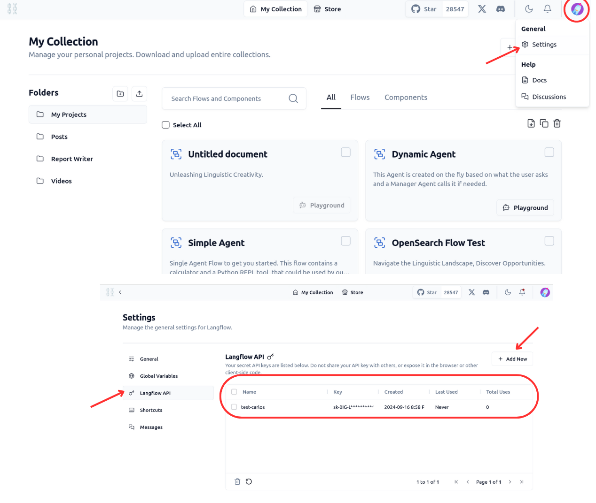
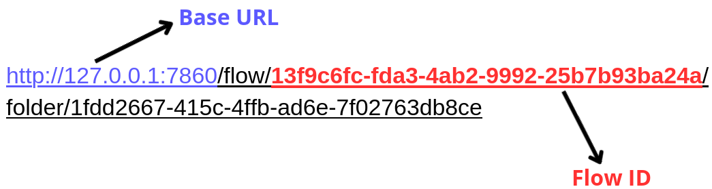

# Langflow-Chainlit Integration Setup

## Table of Contents
1. [Overview](#overview)
2. [Prerequisites](#prerequisites)
3. [Installation and Setup](#installation-and-setup)
   - 3.1. [Setting up a Virtual Environment](#setting-up-a-virtual-environment)
   - 3.2. [Installing Dependencies](#installing-dependencies)
   - 3.3. [Setting Environment Variables](#setting-environment-variables)
   - 3.4. [Obtaining Langflow API Key and Flow ID](#obtaining-langflow-api-key-and-flow-id)
4. [Usage](#usage)
5. [Troubleshooting](#troubleshooting)
6. [Contributing](#contributing)

## 1. Overview

This project integrates Langflow with Chainlit to create a powerful and user-friendly chatbot interface. The integration allows you to design complex language models and workflows in Langflow and then expose them through a Chainlit-powered chat interface.

## 2. Prerequisites

- Python 3.10 or higher
- Langflow server running (locally or remotely)

## 3. Installation and Setup

### 3.1. Setting up a Virtual Environment

It's recommended to use a virtual environment to manage dependencies for this project. Here's how to set it up:

1. Open a terminal and navigate to your project directory.

2. Create a virtual environment:
   ```bash
   python -m venv venv
   ```

3. Activate the virtual environment:
   - On Windows:
     ```bash
     venv\Scripts\activate
     ```
   - On macOS and Linux:
     ```bash
     source venv/bin/activate
     ```

### 3.2. Installing Dependencies

Once your virtual environment is activated, install the required dependencies:

```bash
pip install -r requirements.txt
```

### 3.3. Setting Environment Variables

1. Copy the `.env.example` file in the project root to a new file named `.env`:

```bash
cp .env.example .env
```

2. Open the `.env` file and replace the placeholder values with your actual Langflow configuration:

```env
# Langflow API URL (e.g., http://localhost:7860)
LF_BASE_API_URL=your_langflow_api_url

# Langflow API Key
LF_API_KEY=your_langflow_api_key

# Langflow Flow ID
LF_FLOW_ID=your_langflow_flow_id
```

Replace the following:
- `your_langflow_api_url` with the URL of your Langflow server (e.g., http://localhost:7860)
- `your_langflow_api_key` with your actual Langflow API key (e.g., sk-oph-VQdeGJdxxTd_wouyleFJ0XSII1hFGHUSXuY340w)
- `your_langflow_flow_id` with the ID of the specific flow you want to use (e.g, be21d65f-b2fa-4e43-a2e4-562f81235c1a)

### 3.4. Obtaining Langflow API Key and Flow ID

#### 3.4.1. Langflow API Key

To get your Langflow API Key:

1. Open your Langflow application.
2. Click on the user icon in the top right corner.
3. Select "Settings" from the dropdown menu.
4. In the Settings page, navigate to the "Langflow API" section.
5. Here you can view your existing API keys or create a new one.



#### 3.4.2. Base URL and Flow ID

To find the Base URL and Flow ID:

1. Open the specific flow you want to use in Langflow.
2. Look at the URL in your browser's address bar.
3. The URL will be in this format: `http://127.0.0.1:7860/flow/13f9c6fc-fda3-4ab2-9992-25b7b93ba24a/...`
   - The Base URL is the part before `/flow/`: `http://127.0.0.1:7860`
   - The Flow ID is the UUID after `/flow/`: `13f9c6fc-fda3-4ab2-9992-25b7b93ba24a`



## 4. Usage

### 4.1. Design your Langflow

Use the Langflow UI to design your language model workflow. This is where you'll create the logic for your chatbot.

### 4.2. Start the Chainlit app

Once your Langflow is set up and running, start the Chainlit app:

```bash
chainlit run app.py
```

### 3. Interact with the Chatbot

Open your web browser and navigate to the URL provided by Chainlit (e.g., `http://localhost:8000`). You can now interact with your Langflow-powered chatbot through the Chainlit interface.

## Troubleshooting

- Ensure all environment variables are correctly set in the `.env` file.
- If you encounter any issues with the Langflow connection, verify that Langflow is running and accessible at the URL specified in `LF_BASE_API_URL`.
- Double-check that your `LF_API_KEY` is correct and has the necessary permissions.
- Make sure you have the latest versions of `langflow` and `chainlit` installed.
- If you're experiencing dependency conflicts, ensure you're using the virtual environment and that it's properly activated.

## Contributing

Contributions to improve this integration are welcome. Please feel free to submit issues or pull requests.